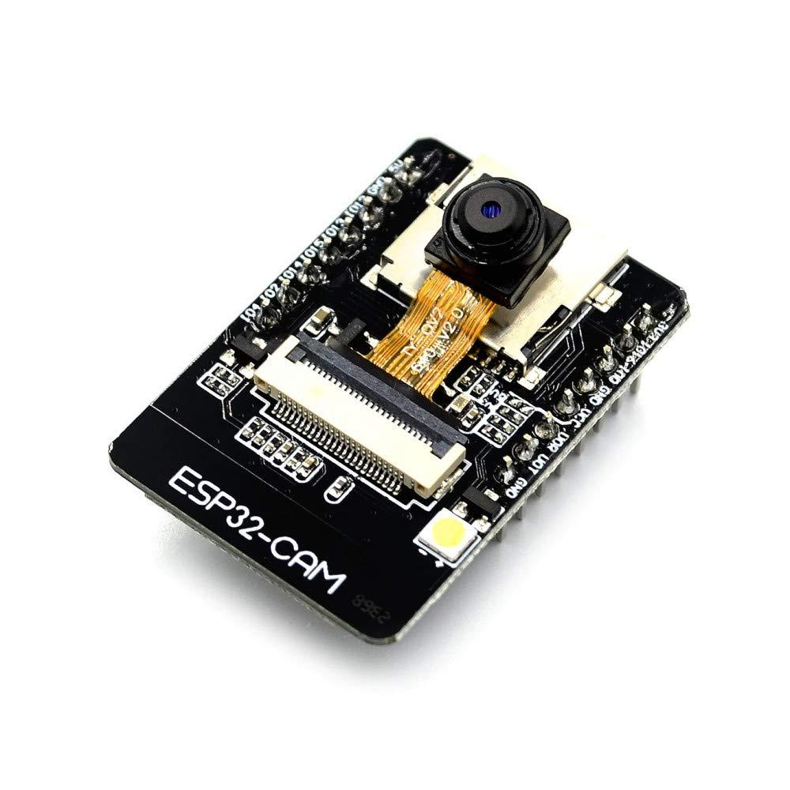
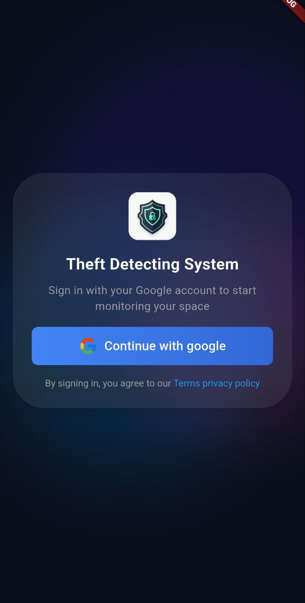
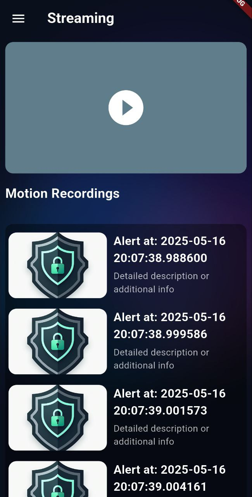
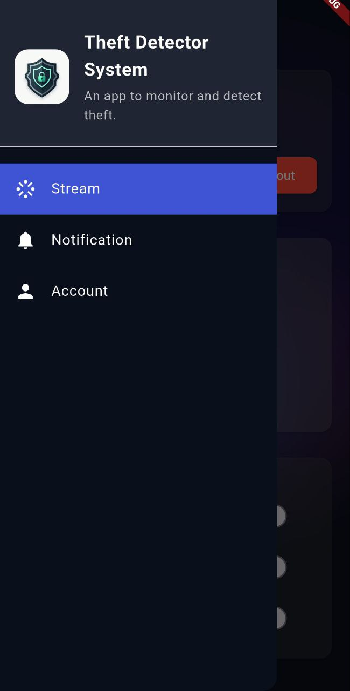
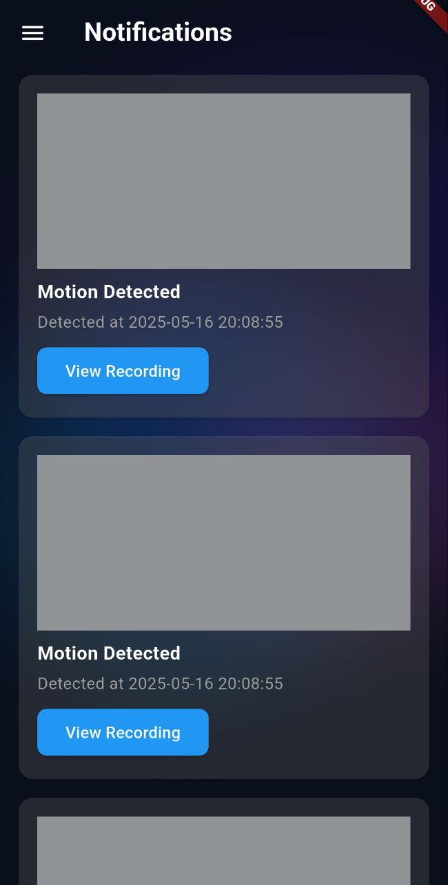
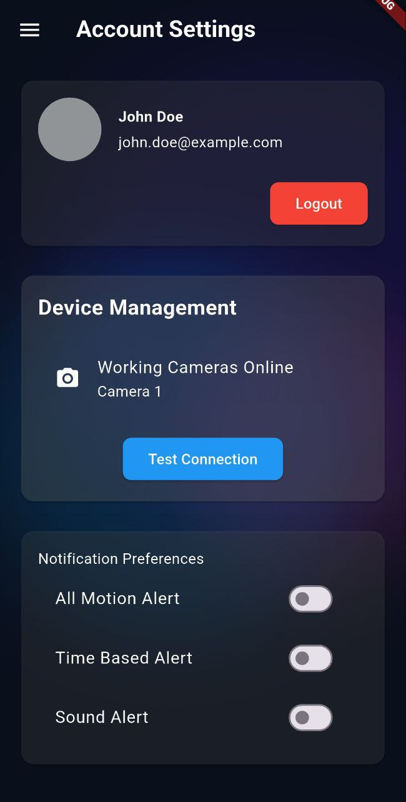

# Real-Time Human Detection and Streaming System

A low-cost, automated smart home security system developed by students at Adama Science and Technology University. This project integrates IoT hardware (ESP32 camera module) for real-time MJPEG video streaming, a Flask-based backend with OpenCV and DeepFace for facial recognition, and user-friendly web (Next.js) and mobile (Flutter) interfaces for remote monitoring and detection of known/unknown individuals.

The system captures video streams, processes screenshots every 10-15 seconds for human detection, and logs results, making it ideal for affordable surveillance in homes, small offices, or retail spaces.

## Table of Contents

- [Features](#features)
- [Technologies Used](#technologies-used)
- [Architecture](#architecture)
- [Installation](#installation)
- [Usage](#usage)
- [Screenshots](#screenshots)
- [Challenges and Solutions](#challenges-and-solutions)
- [Contributors](#contributors)
- [Acknowledgments](#acknowledgments)
- [License](#license)

## Features

- **Real-Time Video Streaming**: ESP32 camera module streams MJPEG video over a local network.
- **Facial Recognition**: Uses DeepFace (VGG-Face model) to detect and classify faces as "known" or "unknown" against a local database.
- **Automated Detection**: Captures and processes screenshots every 10-15 seconds, logging results to a file (e.g., `detection_log.txt`).
- **Web Interface**: Responsive Next.js website for live streaming, viewing processed screenshots, and displaying detection results.
- **Mobile App**: Flutter-based app for remote access to streams, screenshots, and alerts on Android/iOS devices.
- **Local Deployment**: Runs on a local machine with Wi-Fi connectivity, focusing on affordability and ease of setup.
- **Error Handling**: Robust mechanisms to handle network issues like `ConnectionResetError` during streaming.

## Technologies Used

- **Hardware**: ESP32 Camera Module
- **Backend**: Flask, OpenCV (for image processing), DeepFace (for facial recognition)
- **Frontend (Web)**: Next.js
- **Mobile**: Flutter
- **Other Libraries**: FastAPI (for API endpoints), Python for server-side scripting
- **Deployment**: Local network (Wi-Fi dependent)

## Architecture

The system consists of:
- **ESP32 Module**: Captures and streams video.
- **Flask Server**: Processes streams, performs facial recognition, and serves APIs.
- **User Interfaces**: Web and mobile apps connect to the server for real-time data.
- **Database**: Local storage for known faces.

For a detailed diagram, refer to Appendix A in the [project report](link-to-report.pdf).

## Installation

### Prerequisites
- Python 3.8+
- ESP32 board with camera module
    
- Stable local Wi-Fi network
- Node.js (for Next.js web app)
- Flutter SDK (for mobile app)

### Steps
1. **Clone the Repository**:
   ```
   git clone https://github.com/yourusername/your-repo-name.git
   cd your-repo-name
   ```

2. **Backend Setup**:
   ```
   pip install -r requirements.txt  # Install Flask, OpenCV, DeepFace, etc.
   ```

3. **ESP32 Setup**:
   - Upload the Arduino sketch to the ESP32 for MJPEG streaming (code in `/esp32` folder).
   - Configure Wi-Fi credentials in the sketch.

4. **Web App Setup**:
   ```
   cd web
   npm install
   npm run dev
   ```

5. **Mobile App Setup**:
   ```
   cd mobile
   flutter pub get
   flutter run
   ```

6. **Run the Server**:
   ```
   python server.py
   ```
   The server will start capturing streams from the ESP32 IP address.

## Usage

1. Power on the ESP32 and connect it to your local Wi-Fi.
2. Start the Flask server on your local machine.
3. Access the web interface at `http://localhost:3000` (or deployed URL).
4. Open the mobile app on your device.
5. Monitor live streams, view detection logs, and receive alerts for unknown humans.

For detailed testing, evaluate in a controlled environment with good lighting to optimize DeepFace accuracy.

## Screenshots

### Web Interface
 <!-- Placeholder for web image -->

### Mobile App

 




## Challenges and Solutions

- **Network Instability**: Handled `ConnectionResetError` with retry mechanisms and timeouts in the Flask server.
- **Facial Recognition Limitations**: Optimized for frontal faces; future improvements include multi-angle support.
- **Resource Constraints**: Local deployment on mid-range hardware; trade-offs include screenshot intervals to reduce load.
- **Scalability**: Current setup is local; recommendations include cloud integration for remote access.

## Contributors

- [Yohannes Gezachew](mailto:yohannes.gezachew@a2sv.org)
- [Nebiyu Musbah](mailto:nebiyu.musbah@a2sv.org)
- [Abdallah Abdurazak](mailto:abdallahab4595@gmail.com)
- [Abdulaziz Isa](mailto:abdulaziz.isa@a2sv.org)
- [Sadam Husen](mailto:sadam.husen@a2sv.org)
- [Yonas Zekariyas](mailto:yohanzack9@gmail.com)
- [Chera Mihretu](mailto:Chera.Mihretu@a2sv.org)
- [Azariel Tesfaye](mailto:azarieltesfaye2021@gmail.com)


## Acknowledgments

We thank our advisors, faculty, and the open-source community for tools like OpenCV, DeepFace, Flask, and FastAPI. This project was developed as part of the Integrated Engineering Team Project at Adama Science and Technology University.

## License

This project is licensed under the MIT License - see the [LICENSE](LICENSE) file for details.